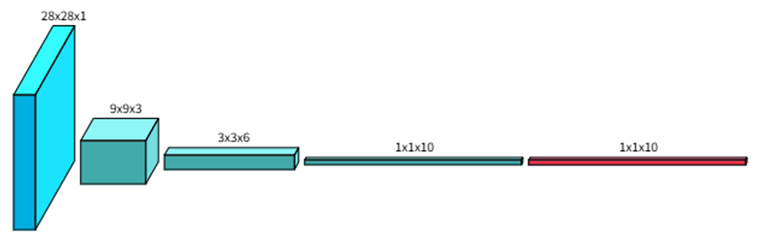
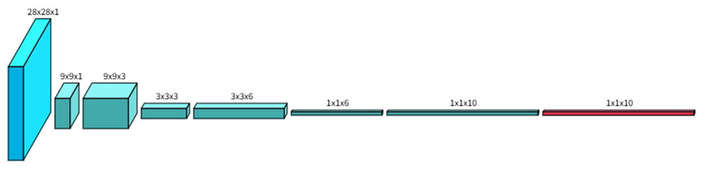

## PTQ手写数字识别CNN网络量化

## 1 CNN网络搭建

### 1.1 普通全卷积网络

由于常见的手写数字识别网络通常包含有线性层，而线性层参数多，因此自己搭建一个全卷积的神经网络，经过几轮迭代后，得到网络如下，网络共3层输出为10个数字的概率，取最大的为最后的结果。



此时进行训练后得到的识别精度为**0.94**左右，但通过对参数进行计算可知（最后的`softmax`不进行计算，因为推理时可以进行省略），该网络参数量为：9 * 3 + 9 * 18 + 9 * 60 = **684**，参数量依旧较大，且计算次数也较多。

网络代码如下：

```python
class MYNet(torch.nn.Module):
    def __init__(self):
        super().__init__()
        # 参数量：9*3+9*18+9*60
        self.cn1 = torch.nn.Conv2d(1, 3, kernel_size=3, stride=3, padding=0, bias=False, groups=1)  # 09 * 09 * 3
        self.cn2 = torch.nn.Conv2d(3, 6, kernel_size=3, stride=3, padding=0, bias=False, groups=1)  # 03 * 03 * 6
        self.cn3 = torch.nn.Conv2d(6, 10, kernel_size=3, stride=3, padding=0, bias=False, groups=1)  # 01 * 01 * 10

    def forward(self, x):
        x = torch.nn.functional.relu(self.cn1(x))
        x = torch.nn.functional.relu(self.cn2(x))
        x = self.cn3(x)
        x = torch.nn.functional.log_softmax(x.view(-1, 10), dim=1)
        return x
```

### 1.2 深度可分离操作

由于上述网络精度较好，且参数量较多，因此对网络进行深度可分离操作，得到网络如下：



修改后网络参数为：9 *1 + 1 *3 + 9 * 9+1 * 18 + 9 * 36 + 1 * 60 = **495**，参数减少了**189**，将近1/3，但是训练后精度只有**0.81**，损失较大。后续部署过程中可以分别进行尝试，如果资源足够的情况下可以直接部署原网络。

此处附上网络代码

```python
class MYNet(torch.nn.Module):
    def __init__(self):
        super().__init__()
        # 深度可分离卷积：9*1+1*3+9*9+1*18+9*36+1*60
        self.dw1 = torch.nn.Conv2d(1, 1, kernel_size=3, stride=3, padding=0, bias=False, groups=1)  # 09 * 09 * 1
        self.pw1 = torch.nn.Conv2d(1, 3, kernel_size=1, stride=1, padding=0, bias=False, groups=1)  # 09 * 09 * 3
        self.dw2 = torch.nn.Conv2d(3, 3, kernel_size=3, stride=3, padding=0, bias=False, groups=3)  # 03 * 03 * 3
        self.pw2 = torch.nn.Conv2d(3, 6, kernel_size=1, stride=1, padding=0, bias=False, groups=1)  # 03 * 03 * 6
        self.dw3 = torch.nn.Conv2d(6, 6, kernel_size=3, stride=3, padding=0, bias=False, groups=6)  # 03 * 03 * 6
        self.pw3 = torch.nn.Conv2d(6, 10, kernel_size=1, stride=1, padding=0, bias=False, groups=1) # 01 * 01 * 10

    def forward(self, x):
        x = torch.nn.functional.relu(self.pw1(self.dw1(x)))
        x = torch.nn.functional.relu(self.pw2(self.dw2(x)))
        x = torch.nn.functional.relu(self.pw3(self.dw3(x)))
        x = torch.nn.functional.log_softmax(x.view(-1, 10), dim=1)

        return x
```

## 2 PTQ量化

PTQ量化即训练后量化，在模型训练完成得到权重后，将训练数据再次输入模型得到每一层计算过程中的最大最小值，并以此计算出每一层的量化因子和零点，计算公式如下：
$$
\begin{align*}
\text{scale} &= \frac{q_{\text{max}} - q_{\text{min}}}{\max_{\text{real}} - \min_{\text{real}}}\\
\text{zero\_point} &= \text{round}\left(q_{\text{min}} - \frac{\min_{\text{real}}}{\text{scale}}\right)
\end{align*}
$$

### 2.1 量化模型建立

在`pytorch`中集成了相关的量化功能，无需我们自己手动进行量化的代码编写。仅需要在源代码基础上进行简单修改即可进行量化操作。

首先进行量化模型的创建，代码如下：(以深度可分离模型为例)

```python
class QuanNet(torch.nn.Module):
    def __init__(self):
        super().__init__()
        self.quant = torch.quantization.QuantStub()
        self.dw1 = torch.nn.Conv2d(1, 1, kernel_size=3, stride=3, padding=0, bias=False, groups=1)  # 09 * 09 * 1
        self.pw1 = torch.nn.Conv2d(1, 3, kernel_size=1, stride=1, padding=0, bias=False, groups=1)  # 09 * 09 * 3
        self.dw2 = torch.nn.Conv2d(3, 3, kernel_size=3, stride=3, padding=0, bias=False, groups=3)  # 03 * 03 * 3
        self.pw2 = torch.nn.Conv2d(3, 6, kernel_size=1, stride=1, padding=0, bias=False, groups=1)  # 03 * 03 * 6
        self.dw3 = torch.nn.Conv2d(6, 6, kernel_size=3, stride=3, padding=0, bias=False, groups=6)  # 03 * 03 * 6
        self.pw3 = torch.nn.Conv2d(6, 10, kernel_size=1, stride=1, padding=0, bias=False, groups=1)  # 01 * 01 * 10
        self.dequant = torch.quantization.DeQuantStub()

    def forward(self, x):
        x = self.quant(x)
        x = torch.nn.functional.relu(self.pw1(self.dw1(x)))
        x = torch.nn.functional.relu(self.pw2(self.dw2(x)))
        x = torch.nn.functional.relu(self.pw3(self.dw3(x)))
        x = self.dequant(x)
        x = torch.nn.functional.log_softmax(x.view(-1, 10), dim=1)
        return x
```

在原模型中加入了`quant`以及`dequant`即可完成量化模型的创建，需要注意的是，虽然在函数`forward`中，量化与反量化仅在卷积前后出现，但是`pytorch`似乎会自动对中间的每一层都进行量化与反量化操作，`quant`以及`dequant`只是表示这中间的层进行量化操作，并不是指，仅在出现的这两个地方进行量化。（由于`log_softmax`无法在int8下进行计算，且最终的推理也不需要`log_softmax`，因此不进行量化，或者可以**直接删除**）

### 2.2 模型量化

在量化模型建立好之后，开始对之前的模型进行量化操作。首先加载原模型。

```python
qnet = QuanNet().to(device)
qnet.load_state_dict(torch.load('./weights/20net.pth'))
```

随后通过`torch.ao.quantization.prepare(qnet)`在模型中插入观察器

```python
qnet.qconfig = torch.ao.quantization.default_qconfig
qnet = torch.ao.quantization.prepare(qnet)
```

插入观察器后进行一轮输入，得到量化因子以及零点

```python
qnet.eval() # 切换到评估模式进行
test_data = get_data_loader(is_train=False)
print("Accuracy:", evaluate(test_data, qnet))
```

得到后开始进行正真的量化，通过`torch.ao.quantization.convert(qnet)`进行，量化后可以进行权重的保存。此处量化精度在0.804左右

```python
qnet = torch.ao.quantization.convert(qnet)
print("Accuracy:", evaluate(test_data, qnet))
detect_fun(qnet, test_data)

torch.save(qnet, 'qnet.pt')
torch.save(qnet.state_dict(), 'qnet.pth')
save_quantized_weights_txt(qnet)
```

### 2.3 权重提取

模型量化完成后需要将**权重、量化参数**进行提取，方便直接部署到FPGA中进行使用，因此需要根据FPGA部署方式进行权重的提取，下面是简单的提取权重到txt文本的代码。运行后代码会保存至`dw_quant_weights_txt`文件夹下的`quant_weight.t`文件中。

```python
def save_quantized_weights_txt(model, output_dir="dw_quant_weights_txt"):
    os.makedirs(output_dir, exist_ok=True)
    weight_file = os.path.join(output_dir, f"quant_weight.txt")
    with open(weight_file, "w") as f:
        for name, module in model.named_modules():
            if isinstance(module, torch.nn.quantized.Conv2d):
                # 获取权重整数表示
                weight_tensor = module.weight().int_repr().cpu().numpy()
                shape = weight_tensor.shape  # (out_channels, in_channels, kernel_h, kernel_w)

                f.write(f"\n---------------Quantize Layer {name}---------------\n")
                # 写入 scale 和 zero_point
                f.write(f"scale: {module.scale}\n")
                f.write(f"zero_point: {module.zero_point}\n")
                # 写入权重
                f.write(f"# Shape: {shape}\n")
                for oc in range(shape[0]):
                    for ic in range(shape[1]):
                        for kh in range(shape[2]):
                            for kw in range(shape[3]):
                                val = weight_tensor[oc][ic][kh][kw]
                                f.write(f"{val} ")
                    f.write(f"\n")
            else:
                if isinstance(module, torch.nn.quantized.modules.Quantize):
                    f.write(f"\n---------------Quantize Layer {name}---------------\n")
                    f.write(f"  Scale: {module.scale.item()}\n")
                    f.write(f"  Zero Point: {module.zero_point.item()}\n")
                    f.write(f"  DType: {module.dtype}\n\n")
    print(f"所有参数已保存到：{weight_file}")
```

权重如下：

```tex
---------------Quantize Layer quant---------------
  Scale: 0.007874015718698502
  Zero Point: 0
  DType: torch.quint8


---------------Quantize Layer dw1---------------
scale: 0.047043610364198685
zero_point: 0
# Shape: (1, 1, 3, 3)
112 32 74 57 25 65 107 33 127 

---------------Quantize Layer pw1---------------
scale: 0.12646149098873138
zero_point: 52
# Shape: (3, 1, 1, 1)
102 
-90 
127 
......
```
